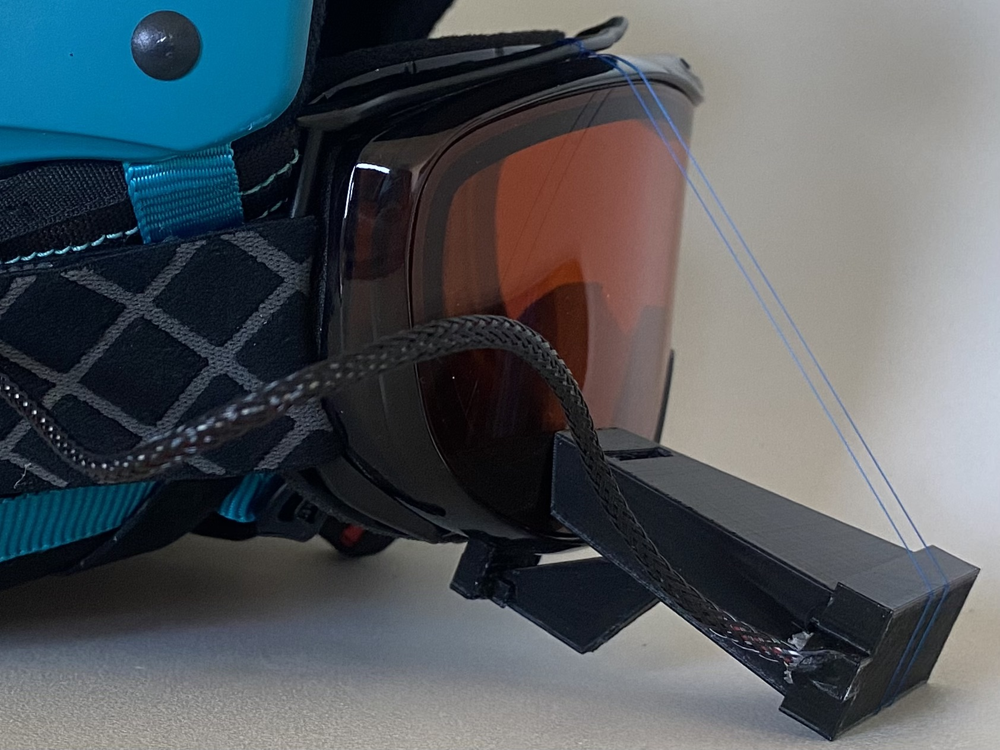

Maker Media GmbH

***

# Head-Up-Display für Skifahrer

**Ein Cockpit für die Skibrille, das Geschwindigkeit, Höhe und Kurs in Echtzeit
anzeigt und deine Sicht nicht stört – so etwas kann man ab rund 500 Euro
kaufen, oder aber selber bauen!**

Der vollständige Artikel zum Projekt steht in der **[Make-Ausgabe 7/23 ab Seite 52](https://www.heise.de/select/make/2023/7)**.
